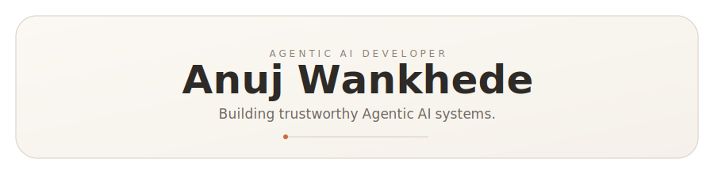

 

 

&nbsp;
&nbsp;
&nbsp;

---

## About

I'm a 3nd-year B.Tech IT student at VIT Pune, currently interning as an **Agentic AI Developer** at Shivrai Technologies — building production-grade RAG pipelines, multi-agent orchestration, and MCP-based tool integrations for real clients.

This year I shipped a **hybrid Qdrant + Neo4j customer support agent** (dense vector + graph-based semantic search, replacing a pure ChromaDB setup) and a **modular agricultural advisory system** where independent MCP tools are orchestrated by a central agent that synthesizes one response per farmer profile. Both are live.

My background spans explainable ML for credit risk (patent filed), IoT field systems deployed for a Maharashtra state utility, and two published research papers. C++ for competitive programming, Python for everything that matters.

> *"A model that isn't trusted, won't be used."*

📍 Pune, Maharashtra &nbsp;·&nbsp; 🎓 VIT Pune, B.Tech IT, 2028 &nbsp;·&nbsp; 🎯 Open to Agentic AI · ML · SWE internships

---

## 🔨 Currently Working On

<!-- ACTIVITY:START -->
> 🔨 **Currently hacking on:** [`—`](https://github.com/Anuz-bit)
> 💬 Last commit: *"Waiting for first push..."*
> 🕐 Pushed: —
<!-- ACTIVITY:END -->

*Auto-updates every 3 hours · Reflects your latest push across all repos*

---

## Work

| Role | Where | What |
|:---|:---|:---|
| **Agentic AI Developer Intern** | Shivrai Technologies · *May 2026 – Present* | Hybrid RAG (Qdrant + Neo4j), MCP orchestration, multi-agent advisory systems |
| **Mobile App Developer** | GridSync × MSEDCL · *2025* | Flutter app — live transformer maintenance system for Maharashtra state utility |

---

## Research & IP

| | Title | Venue |
|:---:|:---|:---|
| `PATENT` | Accident Prevention Smart Glasses — *IP India · App No. 202521056651* | Intellectual Property India, 2025 |
| `PAPER` | Smart Glasses for Driver Drowsiness Detection & Accident Prevention | AIDE-2025 · Hinweis Research |
| `PAPER` | ExamShield: AI-Powered Cheating-Proof Online Examination Platform | IJCRT Journal, 2025 |

---

## 📊 GitHub Analytics

 

 

---

## 🐍 Contribution Graph

<picture>
  <source media="(prefers-color-scheme: dark)" srcset="https://raw.githubusercontent.com/Anuz-bit/Anuz-bit/output/github-snake-dark.svg"/>
  <source media="(prefers-color-scheme: light)" srcset="https://raw.githubusercontent.com/Anuz-bit/Anuz-bit/output/github-snake.svg"/>
  
</picture>

---

